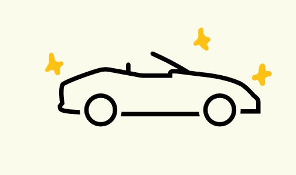
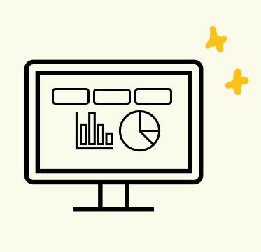

<h2 style="font-family: 'Inter', sans-serif; font-size: 1em;">2025</h2>

  

    Apr 22 <a href="essays/i-literally-dont-know">I Literally Don't Know</a>
  

  <!-- 

    Apr 18 <a href="essays/emails-for-humans">Emails for Humans</a>
  

  

    Apr 08 <a href="essays/what-may-not-age-well">What May Not Age Well</a>
  

  

    Mar 25 <a href="essays/flight-delays">More Than You Ever Wanted to Know About Flight Delays</a>
  

  

    Mar 10 <a href="essays/sailors-and-rowers">Sailors and Rowers</a>
  

  

    Feb 28 <a href="essays/startup-questions">Questions to Ask Before You Join a Startup</a>
  

  

    Feb 15 <a href="essays/consider-opposite">Consider the Opposite</a>
  

  

    Feb 01 <a href="essays/who-did-the-work">Who Did The Work?</a>
  

  

    Jan 20 <a href="essays/not-suck-at-job">How to Not Suck at Your Job</a>
  

  

    Jan 05 <a href="essays/challenge-beliefs">Questions to Challenge Your Beliefs</a>
  

  

    Dec 15 <a href="essays/scrolling-addiction">Cure Your Scrolling Addiction</a>
  

  

    Dec 01 <a href="essays/unconventional-adventures">Unconventional Adventures</a>
  

  

    Nov 18 <a href="essays/questions-for-vcs">Questions for VCs</a>
  
 -->
  

    Apr 05 <a href="essays/find-leverage">finding leverage</a>
  
  
    

    Jan 05 <a href="essays/cool-websites">Cool Websites</a>
  
  

<h2 style="font-family: 'Inter', sans-serif; font-size: 1em;">2024</h2>

  

    Apr 22 <a href="essays/i-literally-dont-know">I Literally Don't Know</a>
  

***

<a href="#projects" style="color: #403324; text-decoration: none; font-size: 1em;">Projects</a>

  

    
    

      <a href="/projects/project-one">Personalized Email Promo Campaigns for Fortune 50 Automotive Company</a>
      <ul style="line-height: 1.4; margin-top: 1rem;">
        <li style="margin-bottom: 0.8rem;">collaborated with the marketing team to execute their email campaigns</li>
        <li style="margin-bottom: 0.8rem;">worked with them for 2 years from 2020 till 2022 and the market conditions were pretty bad especially for the automobile sector due to two reasons:
            1) semi-conductor chip shortages
            2) covid-19</li>
        <li style="margin-bottom: 0.8rem;">despite the pandemic induced market decline in automobile sales, the ml solutions helped client with a total of ~$3M increase in profit</li>
      </ul>
    

  

  

    
    

      <a href="/projects/project-one">Price Elasticity Dashboard for Fortune 200 CPG Company Category Managers</a>
      <ul style="line-height: 1.4; margin-top: 1rem;">
        <li style="margin-bottom: 0.8rem;">collaborated with the data science team and UK category manager to build price elasticity models, score cards and dashboard</li>
        <li style="margin-bottom: 0.8rem;">dashboard enabled simulating changes in volume and revenue with change in price elasticity values wrt competitors
        <li style="margin-bottom: 0.8rem;">solution enabled additional ~$2M increase in profit for uk region</li>
      <!-- </ul> -->
    <!-- 
 -->
  <!-- 
 -->
  
  <!-- <a href="/projects/project-two">Another Interesting Project</a>
  <a href="/projects/project-three">Project Three: The Finale</a> -->
<!-- 
 -->